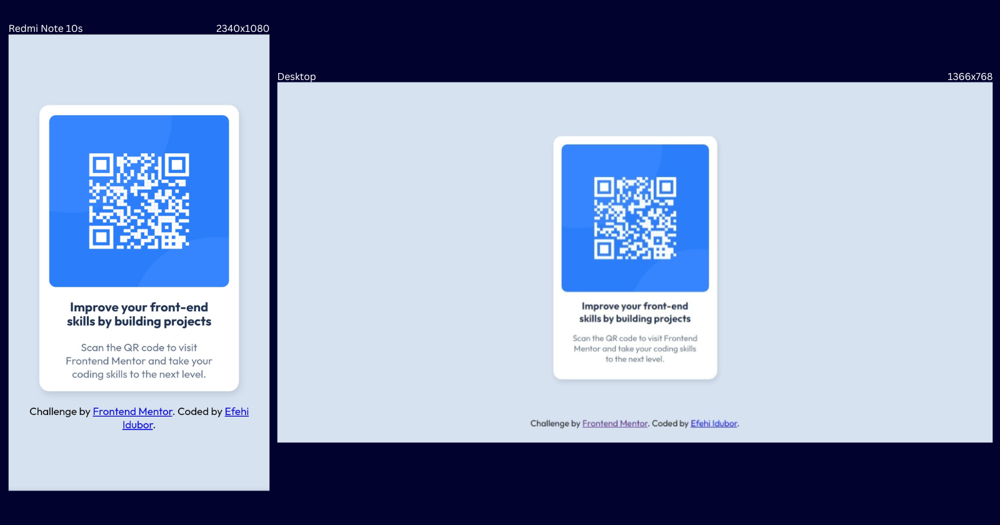

# Frontend Mentor - QR Code Component

My solution to the Frontend Mentor challenge - [QR Code Component](https://www.frontendmentor.io/challenges/qr-code-component-iux_sIO_H).

## 📸 Screenshots

## Project Links

  
## ⚙ Tech Stack

- HTML
- CSS
- Flexbox (CSS)

## 👩‍💻 Developer
 
